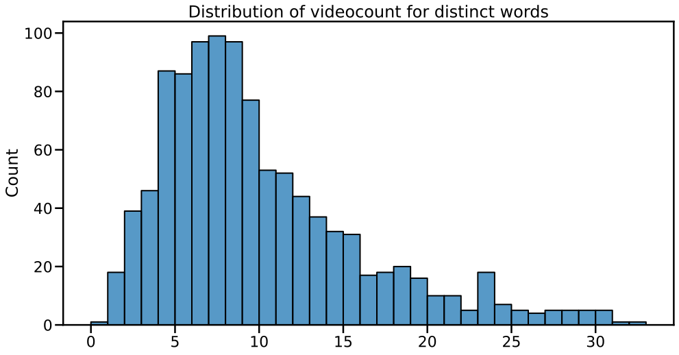
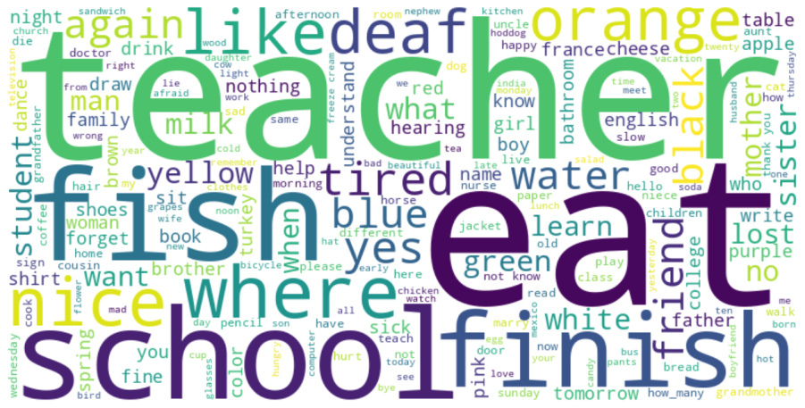

# Sign Language Recognition
Advanced Machine Learning Course BME 2024 Fall
## Goal
To build a neural network that recognizes which words are signed in a video.

## The Data
We used the MS-ASL American Sign Language Dataset dataset, it's available [here](https://www.microsoft.com/en-us/download/details.aspx?id=100121).

Target Variable:
  - 💬 `clean_text`: the word signed in the video

Features:
  - 🔗 `url`: youtube link of the video
  - 🔳 `box`: bounding box of the signer in the video
  - 🎬 `start_time and` and `end_time`: timestamps where the word starts and ends in the video
  - ℹ️ other metadata about the video

Unfortunately, only ~10k of the 17k+ videos were available, that's ~9.5 videos on average for each distinct word.

## The Model
Neural Network made with Tensorflow.
We made the model for the top 20 and the top 30 most common words in the dataset.

## Evalutaion
### TOP 20

    

### TOP 30

    

